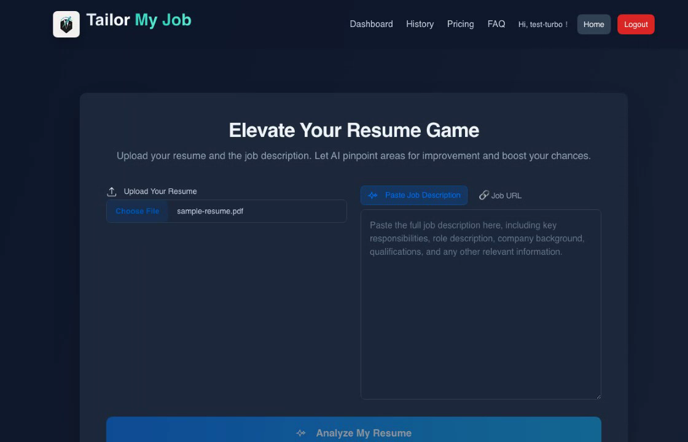
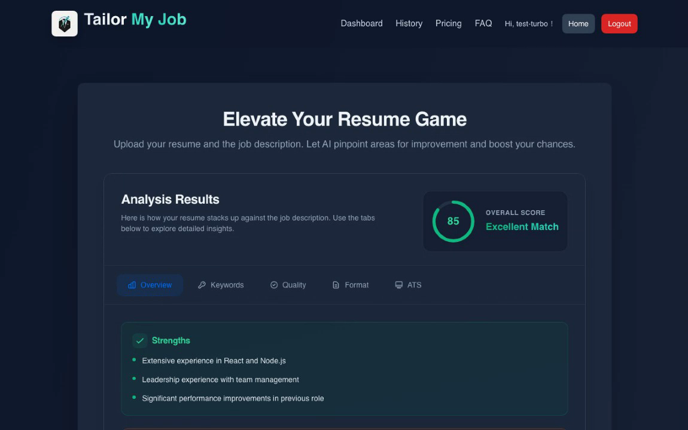

# TailorMyJob - AI 履歷分析平台

> [English](../README.md) | **繁體中文**

  

## 為什麼選擇 TailorMyJob？

找到理想工作已經夠難了，別讓履歷成為你的絆腳石。

- **AI 驅動分析** - 運用 Claude 3.5 Sonnet 獲得智能、可執行的履歷反饋
- **ATS 相容性評分** - 精確了解你的履歷在求職者追蹤系統中的表現
- **個人化建議** - 針對目標職缺獲得量身打造的改進建議
- **雙語支援** - 完整支援繁體中文與英文
- **多格式支援** - 支援 PDF、DOC、DOCX 格式

## 快速開始

只需不到 2 分鐘即可開始：

1. **前往** [tailormyjob.com](https://tailormyjob.com)
2. **上傳** 你的履歷 (PDF、DOC 或 DOCX)
3. **貼上** 目標職缺描述
4. **獲得** AI 驅動的分析與建議

## 功能特色

### 履歷分析
- 整體匹配分數與詳細分析
- 關鍵字優化建議
- 技能差距分析
- 經歷相關性評估

### ATS 優化
- 格式相容性檢查
- 關鍵字密度分析
- 章節結構建議
- 常見 ATS 陷阱偵測

### 可執行的洞察
- 具體改進建議
- 修改前後範例
- 優先順序排序建議
- 產業特定技巧

## 定價方案

| 方案 | 價格 | 功能 |
|------|------|------|
| **Basic** | 免費 | 1 次履歷掃描 |
| **Pro** | $9/月 | 5 次掃描 + 進階分析 |
| **Career Turbo** | $19/月 | 無限掃描 + 所有功能 |

[查看完整定價](https://tailormyjob.com/pricing) | [免費開始試用](https://tailormyjob.com)

## 技術架構

TailorMyJob 採用現代化、可擴展的技術：

- **前端**: Next.js、React、Tailwind CSS
- **後端**: AWS Lambda、API Gateway (無伺服器)
- **AI 引擎**: AWS Bedrock (Claude 3.5 Sonnet)
- **資料庫**: DynamoDB
- **儲存**: Amazon S3
- **金流**: ECPay 綠界金流整合
- **基礎設施**: Terraform (IaC)

## 產品截圖

  
  

## 安全與隱私

你的資料安全是我們的首要任務：

- 所有上傳檔案皆採端對端加密
- 分析完成後自動刪除檔案
- 履歷資料不會用於 AI 訓練
- 符合 GDPR 資料處理規範
- SOC 2 Type II 認證基礎設施 (AWS)

## 常見問題

**Q: AI 分析的準確度如何？**
A: 我們的 AI 採用 Claude 3.5 Sonnet，是目前最先進的語言模型之一。它根據業界最佳實踐提供高度準確的分析。

**Q: 我的履歷資料安全嗎？**
A: 是的。你的檔案經過加密處理，安全儲存，絕不與第三方分享。詳見我們的[隱私政策](https://tailormyjob.com/privacy)。

**Q: 支援哪些檔案格式？**
A: 我們支援 PDF、DOC 和 DOCX 檔案，檔案大小上限為 10MB。

**Q: 可以隨時取消訂閱嗎？**
A: 可以，你可以隨時取消，不收取任何取消費用。

## 開發藍圖

- [ ] 求職信分析
- [ ] LinkedIn 個人檔案優化
- [ ] 面試準備助手
- [ ] AI 建議履歷生成器
- [ ] 求職網站 Chrome 擴充功能

## 貢獻

我們歡迎社群的反饋與貢獻！

- **回報 Bug** - 使用我們的 [Bug 回報範本](../.github/ISSUE_TEMPLATE/bug_report.md)
- **功能請求** - 使用我們的 [功能請求範本](../.github/ISSUE_TEMPLATE/feature_request.md)
- **提出問題** - 使用我們的 [問題範本](../.github/ISSUE_TEMPLATE/question.md)

詳見 [CONTRIBUTING.md](../.github/CONTRIBUTING.md)。

## 聯繫我們

- **網站**: [tailormyjob.com](https://tailormyjob.com)
- **Email**: contact@tailormyjob.com
- **客服**: support@tailormyjob.com
- **安全問題**: security@tailormyjob.com

## Star 歷史

---

  <b>用 AI 優化的履歷，拿下你的夢想工作</b> 
  <a href="https://tailormyjob.com">免費開始使用</a>

